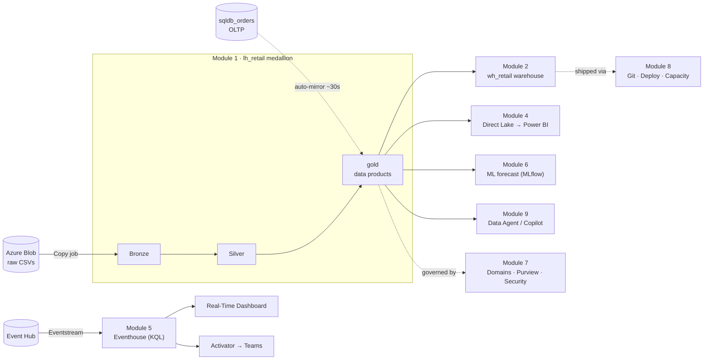

# Microsoft Fabric — Hands-on Demo / Workshop

A follow-along tour of Microsoft Fabric for a technical audience (data engineers, analysts, architects), ~2 hours. Most work happens **in the Fabric portal** with step-by-step READMEs; the medallion pipeline runs as **Spark notebooks** in Module 1.

---

## The story: Contoso Retail in one workspace

**Contoso Retail** operates hundreds of stores across regions. Every day they produce:

- **Batch POS exports** — nightly CSV files (stores, products, sales) that land in **Azure Blob Storage**
- **Operational orders** — a live order-management app on SQL (Module 3)
- **Store telemetry** — freezers, HVAC, foot traffic, checkout queues (Module 5)

We **ingest the blob files with a Copy job into OneLake** (orchestrated visually with a **Task flow**), refine them through a **medallion lakehouse**, serve SQL personas via a **warehouse**, give executives **Direct Lake Power BI**, react to live events with **Real-Time Intelligence**, train an **ML model** on the gold layer, and govern the estate with **Purview, Git, and deployment pipelines**. Module 9 adds **Copilot and agents** on top of everything we built.



> **Ingestion story (Module 1):** raw files live in **Blob Storage**, not pre-loaded into the lakehouse. A **Copy job** pulls them into `lh_retail` `Files/bronze`, and a hand-built **Task flow** maps the whole demo (Get data → Mirror data → Store data → Prepare data → Analyze and train data → Develop data → Visualize data → Track data → Distribute data → Govern data). (The storage account + upload are scripted; the Copy job and Task flow are built live in the portal.)

**One sentence for the room:** *One copy of data in OneLake, every engine, one governance model.*

---

## How to follow

1. **Start with [`module-0-setup/`](module-0-setup/README.md)** — prerequisites, environment setup (scripted or manual), open the workspace.
2. Work through modules **in order**. Each folder has a `README.md` with click-by-click steps plus notebooks / SQL / KQL for that chapter of the story.

| # | Module | Story chapter | Time | Mostly |
| --- | --- | --- | --- | --- |
| 0 | [`module-0-setup`](module-0-setup/README.md) | *"Build the stage"* | 10 min | Setup |
| 1 | [`module-1-onelake-lakehouse`](module-1-onelake-lakehouse/README.md) | *"Land and refine batch sales"* | 20 min | Notebooks + UI |
| 2 | [`module-2-warehouse-vs-lakehouse`](module-2-warehouse-vs-lakehouse/README.md) | *"SQL personas on the same data"* | 15 min | UI + SQL |
| 3 | [`module-3-sql-database-mirroring`](module-3-sql-database-mirroring/README.md) | *"Operational + analytical, no ETL"* | 15 min | UI + SQL |
| 4 | [`module-4-direct-lake-powerbi`](module-4-direct-lake-powerbi/README.md) | *"Executive dashboards, import speed + live data"* | 15 min | UI |
| 5 | [`module-5-real-time-intelligence`](module-5-real-time-intelligence/README.md) | *"The store calls for help"* | 20 min | UI + KQL |
| 6 | [`module-6-machine-learning`](module-6-machine-learning/README.md) | *"Predict, don't just report"* | 20 min | Notebooks |
| 7 | [`module-7-orchestration-governance`](module-7-orchestration-governance/README.md) | *"Run it safely at scale"* | 15 min | UI |
| 8 | [`module-8-alm-capacity`](module-8-alm-capacity/README.md) | *"Ship changes, watch the meter"* | 10 min | UI |
| 9 | [`module-9-ai-agents-copilot`](module-9-ai-agents-copilot/README.md) | *"Talk to your gold layer"* | +15 min | UI |

---

## Notebooks (Module 1)

Each notebook has **detailed markdown cells** — story context, step-by-step explanations, and success criteria. Run in order:

| Notebook | Story beat |
| --- | --- |
| `00_config` | Attach lakehouse, create medallion schemas |
| `01_bronze_ingest` | Land nightly POS CSVs as Delta |
| `02_silver_transform` | Clean, dimensional model, V-Order |
| `03_gold_aggregate` | Business KPI tables for BI |
| `04_vorder_demo` | Prove V-Order size/speed benefit |

Uploaded + run by `pwsh module-1-onelake-lakehouse/run.ps1`, or import manually from `module-1-onelake-lakehouse/`.

---

## Configuration

All scripts read the repo `.env` (copy `.env.example` → `.env`). See [`module-0-setup/README.md`](module-0-setup/README.md).

## Quick start (scripted)

**1. Foundation** (infrastructure + data sources only):

```powershell
Copy-Item .env.example .env        # edit globally-unique names: CAPACITY_NAME, STORAGE_ACCOUNT_NAME, EVENTHUB_NAMESPACE
pwsh module-0-setup/setup.ps1 -Action infra    # capacity + workspace + storage + eventhub + connection + data
```

**2. Each module** — run the code, or follow the UI steps in its README:

```powershell
pwsh module-1-onelake-lakehouse/run.ps1            # lakehouse + notebooks + run (bronze→silver→gold)
pwsh module-2-warehouse-vs-lakehouse/run.ps1       # warehouse + cross-item T-SQL
pwsh module-3-sql-database-mirroring/run.ps1       # SQL DB + mirroring
pwsh module-5-real-time-intelligence/run.ps1       # eventhouse + KQL (Eventstream/Activator are UI)
pwsh module-6-machine-learning/run.ps1             # train + MLflow + score on gold, write predictions back
# Modules 4, 7, 8, 9 are UI-only (portal features) - follow their READMEs
```

**3. Billing**:

```powershell
pwsh module-0-setup/setup.ps1 -Action pause    # stop billing when idle (resume | status)
```

> **`setup.ps1` = stage crew** (infra + data sources only). The data engineering logic lives in the **module run scripts / notebooks**, which run on Fabric.

## Repo layout

| Path | What |
| --- | --- |
| `.env.example` / `.env` | Configuration (`.env` is git-ignored) |
| `module-0-setup/` | Setup guide + `setup.ps1` + sample data |
| `module-1..9-*/` | One folder per story chapter: README + assets |

> A paid Fabric capacity **bills while active** — always `pwsh module-0-setup/setup.ps1 -Action pause` when you stop. A 60-day Fabric trial is a free alternative.
