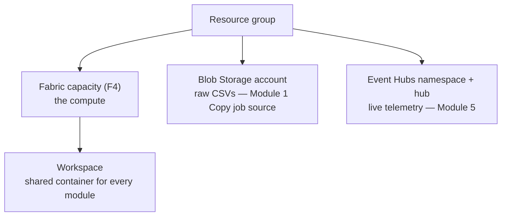

# Module 0 — Setup

**Story chapter:** *"Build the stage for Contoso Retail"*

Read this **first**. It explains the split between **infrastructure** (one script) and **each module** (its own `run.ps1` *or* UI follow-along).

---

## The mental model (important)

| Layer | What | How |
| --- | --- | --- |
| **Infrastructure + data sources** | Resource group, Fabric **capacity**, the **workspace**, **Blob Storage** (raw CSVs), **Event Hub** (telemetry) | `module-0-setup/setup.ps1` |
| **Each module's Fabric items + logic** | Lakehouse, warehouse, SQL DB, eventhouse, notebooks, transforms, etc. | Per-module **`run.ps1`** *or* the module's **UI steps** |

`setup.ps1` deliberately does **not** build the per-module Fabric items. It lays the foundation; then for each module you either:

- **Run the code:** `pwsh module-N-*/run.ps1` — builds that module's items and produces the end result, **or**
- **Follow the UI:** the click-by-click steps in that module's `README.md`.

> Not every module has a `run.ps1`. Modules **1, 2, 3, 6** do (and **5** partially). Modules **4, 7, 8, 9** are portal features — **UI only**.

---

## What `setup.ps1` provisions



| `.env` item | Default |
| --- | --- |
| Capacity | `ntwfabricdemo` (F4) |
| Workspace (+ Test) | `Fabric-Demo-Workshop` (+ `-Test`) |
| Storage | `ntwfabricdemostg` / container `retail-raw` |
| Event Hub | `ntwfabricdemoeh` / `telemetry` |

---

## Prerequisites

- Browser + https://app.fabric.microsoft.com, Fabric-enabled tenant.
- **Azure CLI** (`az login`), **PowerShell 7** (`pwsh`).
- Rights to create a Fabric capacity + storage + event hub in your subscription (or point `.env` at existing ones).

---

## One-time foundation

From the **repo root**:

```powershell
Copy-Item .env.example .env     # edit AZURE_SUBSCRIPTION_ID, REGION, CAPACITY_NAME,
                                #      STORAGE_ACCOUNT_NAME, EVENTHUB_NAMESPACE (all globally unique)
pwsh module-0-setup/setup.ps1 -Action infra      # deps + capacity + workspace + storage + eventhub + connection + data
```

Then do each module (code or UI). Pause billing when idle:

```powershell
pwsh module-0-setup/setup.ps1 -Action pause      # resume | status
```

### `setup.ps1` actions

| `-Action` | Does |
| --- | --- |
| `deps` | Azure CLI check + `microsoft-fabric` extension |
| `infra` | **Everything below**: capacity + workspace + storage + eventhub + connection + sample data |
| `capacity` | Create the Fabric capacity (if missing) |
| `workspace` | Create the workspace(s) on the capacity (+ workspace identity) |
| `storage` | Create Blob Storage account + container, upload raw CSVs |
| `eventhub` | Create Event Hubs namespace + hub (Module 5 source) |
| `connection` | Create a Fabric cloud connection to the blob (Module 1 Copy job) |
| `data` | (Re)generate the local sample data only |
| `send-events` | Stream `telemetry.ndjson` into the Event Hub (run during the Module 5 demo) |
| `pause` / `resume` / `status` | Capacity billing control |
| `teardown` | Delete the workspace(s) (`-DeleteCapacity` / `-DeleteResourceGroup` for more) |

---

## Per-module: code vs UI

| Module | `run.ps1`? | What the code path does |
| --- | --- | --- |
| 1 — Lakehouse | ✅ | Create lakehouse, upload CSVs→`Files/bronze`, upload + run notebooks `00`–`04` |
| 2 — Warehouse | ✅ | Create warehouse, run `warehouse_ddl.sql` + `cross_query.sql` |
| 3 — SQL DB + mirroring | ✅ | Create SQL DB, run `oltp_seed.sql` (mirrors automatically) |
| 6 — Machine Learning | ✅ | Train + MLflow-log a model on gold, register, score, write predictions back |
| 5 — Real-Time | 🟡 partial | Create eventhouse + KQL table/mapping; Eventstream/Activator are UI |
| 4 — Direct Lake | ❌ UI only | Semantic model + report are portal-built |
| 7 — Orchestration/Gov | ❌ UI only | Pipelines/dataflows/domains/Purview/MPE |
| 8 — ALM/Capacity | ❌ UI only | Git, deployment pipelines, Metrics app |
| 9 — AI agents | ❌ UI only | Copilot / Data Agent are interactive |

Each module README starts with: *"Run `run.ps1` for the end result, or follow the UI steps below."*

---

## Manual (portal-only) alternative for the foundation

If you can't run Azure CLI (e.g. trial-only):

1. **Workspace** → `Fabric-Demo-Workshop` → License = your capacity or Trial.
2. Create the **Blob Storage account** + container in the Azure portal and upload `module-0-setup/data/*.csv` (run `setup.ps1 -Action data` locally to generate them first).
3. Then do each module via its UI steps.

---

## Troubleshooting

| Symptom | Fix |
| --- | --- |
| Capacity not visible after create | Wait ~1 min, re-run |
| Fabric / SQL token error | `az login` |
| Spark cold start 2–3 min | Pre-run cell 1 of `01` before the demo |
| Workspace items won't load | Capacity paused → `setup.ps1 -Action resume` |

## Cost

Pause when idle: `pwsh module-0-setup/setup.ps1 -Action pause`.

**Next:** [`module-1-onelake-lakehouse/`](../module-1-onelake-lakehouse/README.md)
