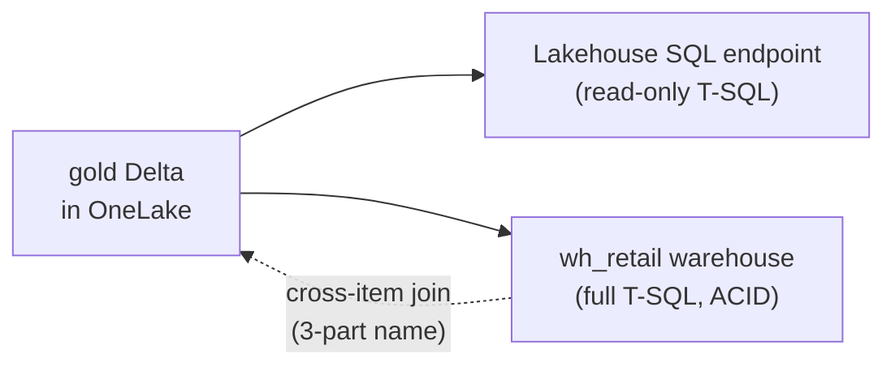

# Module 2 — Warehouse vs Lakehouse

**Story chapter:** *"SQL personas on the same OneLake data"*

~15 min · **UI** (warehouse SQL editor) + SQL scripts in this folder.

> **Two ways to do this module:**
> - **Code:** `pwsh module-2-warehouse-vs-lakehouse/run.ps1` — creates `wh_retail` and runs `warehouse_ddl.sql` + `cross_query.sql`.
> - **UI follow-along:** the steps below.
> Prereq: Module 1 produced the gold tables.

---

## Where this fits

| Before | This module | After |
| --- | --- | --- |
| Module 1 built gold Delta in `lh_retail` | Two SQL surfaces on **one copy** of data | Module 4 Direct Lake reads the same gold; Module 3 adds mirrored OLTP |

Contoso has **two types of SQL users**:
- **Analysts** who query what Spark built (read-only)
- **DBAs / BI engineers** who need full T-SQL, transactions, and warehouse performance

Fabric gives both — without duplicating the Delta files.



---

## 2.1 Lakehouse SQL analytics endpoint (read-only)

1. Open **`lh_retail`** → mode switcher → **SQL analytics endpoint**.
2. **New SQL query:**
   ```sql
   SELECT TOP 10 * FROM gold.sales_by_category ORDER BY net_sales DESC;
   ```
3. Prove read-only — let it fail:
   ```sql
   DELETE FROM gold.sales_by_category;   -- errors: endpoint is read-only
   ```

Analysts get T-SQL over Spark output; all writes stay in notebooks — an intentional read/write separation.

---

## 2.2 Warehouse — full T-SQL + cross-item joins

1. **Create the warehouse** (if it doesn't exist yet): workspace → **+ New item → Warehouse** → name **`wh_retail`** → **Create**. *(Already exists if you ran `module-2-warehouse-vs-lakehouse/run.ps1`.)* Then open it → **New SQL query**.
2. Paste and run **`warehouse_ddl.sql`**:
   - Builds `dbo.dim_store`, `dbo.fact_sales_daily` from **`lh_retail.gold.sales_by_store_day`** (three-part name — cross-item, zero copy)
   - Runs a **multi-table ACID transaction** (lakehouse endpoint cannot)
3. Run **`cross_query.sql`** — joins warehouse table to lakehouse table in one query.

The warehouse targets SQL developers: full DDL/DML, stored procedures, and V-Order by default — over the same Delta files underneath.

> **Copilot:** SQL editor → autocomplete or *"generate top categories by net sales"*. Module 9 for full agent tour.

---

## 2.3 Persona decision (optional framing)

| Need | Pick |
| --- | --- |
| Python/Scala, ML prep, big ETL | **Lakehouse** + notebooks |
| T-SQL, transactions, BI serving at scale | **Warehouse** |
| Both on same data | **Both** — one OneLake copy |

Also query **`gold.sales_by_region`** (built in notebook `03`):
```sql
SELECT * FROM lh_retail.gold.sales_by_region;
```

---

## Checklist → Module 3

- [ ] Lakehouse SQL endpoint shown read-only
- [ ] Warehouse DDL + cross-item join executed

**Next:** [`module-3-sql-database-mirroring/`](../module-3-sql-database-mirroring/README.md) — Contoso's order app writes OLTP; analytics sees it in ~30 seconds.
