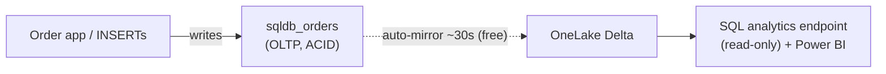

# Module 3 — SQL Database in Fabric + Mirroring

**Story chapter:** *"Operational + analytical — no nightly ETL"*

~15 min · **UI** + **`oltp_seed.sql`** in this folder.

> **Two ways to do this module:**
> - **Code:** `pwsh module-3-sql-database-mirroring/run.ps1` — creates `sqldb_orders` and seeds orders (they mirror to OneLake automatically).
> - **UI follow-along:** the steps below.

---

## Where this fits

| Before | This module | After |
| --- | --- | --- |
| Batch POS data in lakehouse gold | Live **order app** on Fabric SQL DB | Mirrored Delta in OneLake; can be blended with gold in a notebook |

Contoso's e-commerce team runs an **order-management app** against **`sqldb_orders`**. Finance and ops want those orders in the **same analytical estate** as POS sales — without a fragile nightly sync job.

**Mirroring** copies committed OLTP changes to Delta in OneLake within ~**30 seconds**. Mirroring compute is **free**; you pay storage + query compute.



---

## 3.1 Create the operational schema

1. **Create the SQL database** (if it doesn't exist yet): workspace → **+ New item → SQL database** → name **`sqldb_orders`** → **Create**. *(Already exists if you ran `module-3-sql-database-mirroring/run.ps1`.)* Then open it → **New query**.
2. Paste **`oltp_seed.sql`** → run the **schema** section once (`dbo.Orders`, `dbo.OrderItems`).

This is a real OLTP engine — IDENTITY columns, defaults, ACID — i.e. an application database, not a warehouse.

---

## 3.2 Insert orders → watch the mirror (headline)

1. Run the **INSERT** section of `oltp_seed.sql`.
2. Confirm in OLTP: `SELECT TOP 20 * FROM dbo.Orders ORDER BY order_id DESC;`
3. Switch to **SQL analytics endpoint** of the same database (or open the mirrored endpoint item).
4. Same query — rows appear as **Delta in OneLake** within ~30s.

Translytical: the app writes here while analysts query the mirrored copy — one source of truth, no pipeline schedule.

> Want this data **inside `lh_retail`** (to blend with gold)? The mirror lives under the `sqldb_orders` item — surface it in the lakehouse with a shortcut (no copy). See **§3.4**.

---

## 3.3 Confirm mirroring status

1. **`sqldb_orders`** → **Replication / Mirroring** (or Monitor replication).
2. Status = **Running**, all tables mirrored.

~30s mirroring SLO with free mirror compute; combined with GraphQL, schema source control, and deployment-pipeline support, it serves as a real application backend.

> **Copilot:** SQL editor completion + NL-to-SQL. Module 9 for agents.

---

## 3.4 Surface the mirror in the lakehouse (OneLake shortcut)

Mirroring on a **Fabric-native SQL database is automatic** — there's nothing to "turn on" to a lakehouse. The committed rows continuously replicate to OneLake as Delta **under the `sqldb_orders` item**. To use them *inside* `lh_retail` (Spark + the lakehouse SQL endpoint), point a **shortcut** at that mirrored Delta — zero copy:

1. `lh_retail` → **Tables** → **New shortcut** → **Microsoft OneLake**.
2. Select **`sqldb_orders`** → tick the mirrored tables **`Orders`** (and `OrderItems`).
3. They now appear as tables in `lh_retail`, queryable like any other — e.g. in a notebook:
   ```python
   orders = spark.table("Orders")            # the shortcut, read in place
   display(orders.groupBy("store_id").sum("order_total"))
   ```
   …and you can join them to `gold.sales_by_store_day` — **POS batch + live app orders in one query, no copy** (translytical).

> **External** sources (Azure SQL, Cosmos DB, Snowflake) instead use a **Mirrored Database** item — **+ New → Mirrored Azure SQL Database / …** — which sets up the replication into OneLake. Our SQL DB is Fabric-native, so it mirrors with no setup.

---

## Checklist → Module 4

- [ ] Orders inserted in OLTP
- [ ] Same rows visible on analytics endpoint within ~30s
- [ ] Mirroring = Running
- [ ] (Optional) Shortcut surfaces `Orders` inside `lh_retail` (§3.4)

**Next:** [`module-4-direct-lake-powerbi/`](../module-4-direct-lake-powerbi/README.md) — executives consume gold via Direct Lake.
