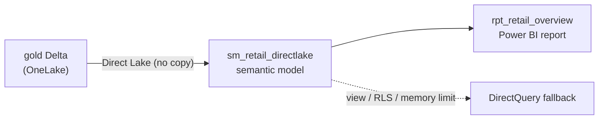

# Module 4 — Direct Lake + Power BI

**Story chapter:** *"Executive dashboards — import speed, live data"*

~15 min · All **UI**.

> **UI-only module** — no `run.ps1`. The semantic model + report are portal-built. Follow the steps below. Prereq: Module 1 gold tables exist.

---

## Where this fits

| Before | This module | After |
| --- | --- | --- |
| Gold tables in `lh_retail` (Module 1) | Semantic model reads Delta **directly** | Module 9 Data Agent + Power BI agent query this model |

Contoso's leadership wants **regional sales dashboards** that refresh when stores close — not tomorrow morning after an import job. **Direct Lake** loads parquet from OneLake into the Analysis Services engine like Import, but data stays live like DirectQuery — **no duplicate semantic copy, no scheduled refresh**.



---

## 4.1 Build Direct Lake semantic model

1. **`lh_retail`** → **SQL analytics endpoint** → **Reporting** → **New semantic model**.
2. Name **`sm_retail_directlake`**. Select gold tables: `sales_by_store_day`, `sales_by_category` (+ silver dims if you want relationships).
3. Confirm **Storage mode = Direct Lake** on each table.
4. Measure:
   ```DAX
   Net Sales = SUM(sales_by_store_day[net_sales])
   ```

Data is read straight from OneLake Delta — no import job and no per-visual DirectQuery round-trip.

> **Copilot / Power BI agent:** *"Create a page summarizing net sales by region"*. Module 9 expands this.

---

## 4.2 Quick report (with a US map)

The gold table carries a **`state`** column (US states — e.g. California, Texas), so you can shade a map by sales.

1. **New report** from the model → **Save** as **`rpt_retail_overview`**.
2. *(One-time, for clean geocoding)* in the model select **`sales_by_store_day[state]`** → **Properties → Data category = State or Province**.
3. Add visuals:
   - **Card** — Net Sales
   - **US map by state** — **Filled map** (works in the browser/service): **Location = `state`**, **Color saturation = Net Sales** → states shade by sales. *(In Power BI Desktop you can instead use the **Shape map** visual → built-in map **USA: States**; enable it under Options → Preview features.)*
   - **Column chart** — Net Sales by `region`
   - **Line chart** — Net Sales by `sale_date`

This report is the artifact Module 7 lineage and Module 9 agents reference.

---

## 4.3 DirectQuery fallback (teaching moment)

Direct Lake **falls back** to DirectQuery when rules are violated (views, RLS, capacity limits).

**Option A — SQL view (most reliable):**
```sql
CREATE VIEW gold.v_sales_by_region AS
SELECT region, SUM(net_sales) AS net_sales FROM gold.sales_by_store_day GROUP BY region;
```
Add view to model → visuals using it fall back.

**Option B — Row-Level Security** at SQL layer.

---

## 4.4 Behavior settings

Model **Settings** → **Direct Lake behavior**:

| Mode | Behavior | Use when |
| --- | --- | --- |
| `Automatic` | Direct Lake; silent fallback to DirectQuery | Production |
| `DirectLakeOnly` | Errors instead of falling back | Prove you stayed in Direct Lake |
| `DirectQueryOnly` | Always DirectQuery | Troubleshooting / baseline |

Set **`DirectLakeOnly`** on view visual → error → back to **`Automatic`** → renders via fallback.

**Performance Analyzer** shows query path.

---

## Checklist → Module 5

- [ ] Direct Lake model + `rpt_retail_overview` on gold
- [ ] Fallback trigger + behavior modes demonstrated

**Next:** [`module-5-real-time-intelligence/`](../module-5-real-time-intelligence/README.md) — while batch sales refresh nightly, **freezer sensors need sub-second alerts**.
