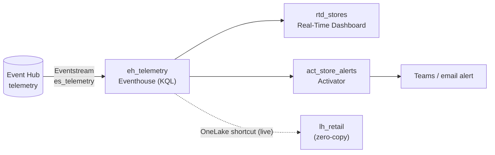

# Module 5 — Real-Time Intelligence

**Story chapter:** *"The store calls for help — before the batch job runs"*

~20 min · **UI** + KQL scripts in this folder. **Protect this time** — highest wow factor.

> **Two ways to do this module:**
> - **Code (partial):** `pwsh module-5-real-time-intelligence/run.ps1` — creates the eventhouse + `StoreTelemetry` table/mapping. Feed live data with `pwsh module-0-setup/setup.ps1 -Action send-events`.
> - **UI follow-along:** the steps below. **Eventstream, Real-Time Dashboard, and Activator are UI-only.**

---

## Where this fits

| Before | This module | After |
| --- | --- | --- |
| Batch sales in gold (Modules 1–4) | **Live** store telemetry | Module 9 Operations agent asks questions over this stream |

Contoso's stores have IoT sensors: **freezer** temperature, **HVAC**, **foot traffic**, **checkout queue** depth. A freezer failure can't wait for tomorrow's POS export. **Real-Time Intelligence** ingests events, stores them in **Eventhouse**, dashboards them in seconds, and **Activator** pings Teams when thresholds breach.



Sample events live in `module-0-setup/data/telemetry.ndjson`; `setup.ps1 -Action send-events` streams them into the Event Hub.

---

## 5.1 Prepare KQL table

1. **Create the eventhouse** (if it doesn't exist yet): workspace → **+ New item → Eventhouse** → name **`eh_telemetry`** → **Create** (this also creates a KQL database of the same name). *(Already exists if you ran `module-5-real-time-intelligence/run.ps1`.)*
2. Open the **`eh_telemetry`** KQL database → **New → KQL queryset**.
3. Run **`eventhouse_setup.kql`** — creates `StoreTelemetry` + JSON mapping `telemetry_map`.

---

## 5.2 Eventstream — ingest live events

1. **+ New item → Eventstream** → **`es_telemetry`**.
2. **Add source → Azure Event Hubs** → the namespace **`ntwfabricdemoeh`**, hub **`telemetry`** (provisioned by `setup.ps1 -Action eventhub`). Auth = the connection / key. *(Fallback: **Sample data** or a **Custom endpoint** if the hub isn't available.)*
3. **Add destination → Eventhouse** → `eh_telemetry` / table **`StoreTelemetry`** / mapping **`telemetry_map`**.
4. *(Optional)* drop an **event-processing** step between source and destination — filter to `freezer` only, or a **windowed average** — to show no-code stream transforms.
5. **Publish**.
6. Now **stream real events** from your laptop:
   ```powershell
   pwsh module-0-setup/setup.ps1 -Action send-events
   ```
   Watch them flow Event Hub → Eventstream → Eventhouse in the live preview.

Eventstream provides no-code routing, filtering, and windowing over a real Azure Event Hub source — on the same platform as the batch work, not a separate stack.

---

## 5.3 Real-Time Dashboard

1. **+ New → Real-Time Dashboard** → **`rtd_stores`**.
2. Paste queries from **`dashboard_queries.kql`**:
   - **A** — latest per sensor (stat/table tile)
   - **B** — 1-min averages (`render timechart`)
3. Auto-refresh ~30s.

---

## 5.4 Activator (Reflex) — the money moment

**Activator** is Fabric's no-code event-detection engine. It watches a stream (or Power BI/KQL data), tracks **objects** and their **properties** over time, and **triggers an action** when a condition holds. This is the closing beat of the real-time story.

### 5.4a Create the Activator and point it at the stream
1. **+ New item → Activator** → name **`act_store_alerts`** (or, from `es_telemetry`, **Add destination → Activator** to wire it directly).
2. **Get data → Eventstream** → `es_telemetry` (the live `StoreTelemetry` events).
3. **Assign your data to an object:**
   - **Object** = *Store* (or *Sensor*), keyed by **`store_id`** (so each store is tracked independently).
   - **Properties** = `value`, `sensor`, `unit` mapped from the event fields.

### 5.4b Build the rule
1. **+ New rule** on the object → **`Freezer over threshold`**.
2. **Condition:** property **`value`** **is greater than `5`** **and** `sensor` **equals** `freezer`.
   - Optionally add *"stays above 5 for 2 minutes"* to show **time-window** conditions (debounces single noisy readings).
3. **Action:**
   - **Teams message** or **Email** to yourself (include `store_id`, `value`, `event_ts` in the message), **or**
   - **Power Automate flow** (for the +15 deep-dive — e.g. create a ServiceNow ticket), **or**
   - **Fabric item** action (e.g. run a pipeline/notebook to log the incident).
4. **Save & Start** the rule.

### 5.4c Fire it live
```powershell
pwsh module-0-setup/setup.ps1 -Action send-events     # streams freezer readings, some > 5C
```
A breaching reading flows Event Hub → Eventstream → Activator → **your Teams/email** within seconds. Open the rule's **Activation history** to show what tripped it and the property value at that moment.

Activator gives sub-second detection on live data with no polling code: per-store objects, time-window conditions, and any action target. It pairs with the Module 9 Operations agent for natural-language diagnostics over the same stream.

> **Why it's not in `run.ps1`:** Activator objects/rules are authored in the portal (the binding of stream→object→property→action is a visual experience). The stream + data it reacts to **are** scripted (`send-events`).

> **Copilot:** KQL queryset → NL to KQL. Module 9 for the Operations agent.

---

## 5.5 Zero-copy shortcut to the live stream (the federation headline)

This is where **shortcuts** finally shine — over **changing** data, not a static copy. The lakehouse reads the eventhouse's live telemetry *in place*, and the row count grows as events arrive.

1. In the **`eh_telemetry`** KQL database, enable **OneLake availability** (database → policies, or the table's **OneLake** toggle). The `StoreTelemetry` table is now mirrored to OneLake as Delta.
2. In **`lh_retail`** → **Tables** → **New shortcut → Microsoft OneLake** → select the `eh_telemetry` KQL database → **`StoreTelemetry`**.
3. Query the shortcut from the lakehouse SQL analytics endpoint (or a notebook):
   ```sql
   SELECT COUNT(*) AS rows, MAX(event_ts) AS latest FROM StoreTelemetry;
   ```
4. Stream more events and re-query:
   ```powershell
   pwsh module-0-setup/setup.ps1 -Action send-events
   ```
   The **count climbs through the shortcut** — no copy, no pipeline, no refresh. That is "don't move data, point at it," made visible in real time.

This is the demo's zero-copy shortcut moment — the same OneLake shortcut feature, shown over **live** data so the "point at it, don't copy it" story is obvious.

---

## Talking points (RTI platform)

| Component | Role |
| --- | --- |
| **Real-Time Hub** | Tenant catalog of streams; connectors (Event Hubs, Kinesis, Pub/Sub, Debezium CDC) |
| **Eventstream** | Ingest + transform + route |
| **Eventhouse / KQL** | Durable store + query language |
| **Activator** | Event-driven rules → Teams / email / Power Automate |

---

## Checklist → Module 6

- [ ] Events flowing Eventstream → Eventhouse
- [ ] Live dashboard tile
- [ ] Activator fired on threshold breach
- [ ] Shortcut over the live KQL table — row count grows through the pointer (§5.5)

**Next:** [`module-6-machine-learning/`](../module-6-machine-learning/README.md) — train + score an ML model on the gold layer.
