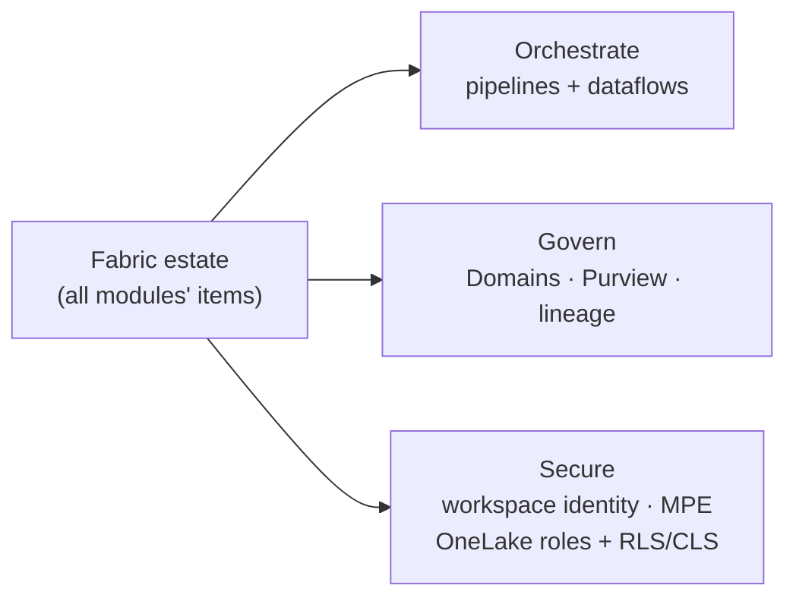

# Module 7 — Orchestration, Governance & Security

**Story chapter:** *"Run Contoso's estate safely at scale"*

~15–18 min · Mix of **live build** (pipeline/dataflow) and **show-and-tell** (domains, Purview, security).

> **UI-only module** — no `run.ps1`. Pipelines, dataflows, domains, Purview, and network security are portal/admin features. Follow the steps below.

---

## Where this fits

| Before | This module | After |
| --- | --- | --- |
| Batch + streaming + BI built ad hoc | **Repeatable** ingestion + **governed** sharing | Module 8 ships changes via Git/pipelines |

Contoso now has lakehouse gold, warehouse tables, mirrored orders, Direct Lake reports, and live telemetry. Enterprise IT asks: *Who owns Retail data? How do we label confidential reports? How does Spark reach private Azure SQL without public internet?*

---

## 7.1 Data Pipeline — orchestration

1. Open **`pl_ingest`** (or **+ New → Data pipeline**).
2. **Copy data:** source = `Files/bronze` or HTTP CSV → destination = lakehouse table.
3. **Notebook activity:** **`02_silver_transform`**.
4. Connect **Copy → Notebook** (On success) → **Run**.

Copy is the cheap bulk mover; pipelines add orchestration (If/ForEach/Wait); notebooks and dataflows carry the business logic.

---

## 7.2 Dataflow Gen2 — citizen transforms

1. **+ New → Dataflow Gen2** → **`df_clean`**.
2. **Get data → CSV** → Power Query steps (types, trim, unpivot).
3. Destination = **`lh_retail`** → **Publish**.

Dataflow Gen2 offers 300+ analyst-friendly transforms, but row-by-row shaping costs more CU — pair it with pipelines for bulk movement.

---

## 7.3 Governance (show-and-tell)

| Topic | Demo | Narrative |
| --- | --- | --- |
| **Domains / Data mesh** | Admin portal → Domains → assign workspace to **Retail** | Gold tables = domain **data products** shared via Shortcuts |
| **Purview labels** | `sm_retail_directlake` → **Confidential** | Label follows export to Excel/PDF |
| **Lineage** | Workspace → **View → Lineage** | `sqldb_orders` → `lh_retail` → model → `rpt_retail_overview` |
| **DLP** | Mention | Blocks oversharing PII |

---

## 7.4 Security & networking

### Workspace identity (provisioned in Module 0)
- **Workspace settings → Workspace identity** — Entra managed identity (no secrets in pipelines).
- Backbone for Trusted Workspace Access + Managed Private Endpoints.

### Trusted Workspace Access
- Storage firewall = deny public → workspace identity allow-listed → Shortcuts/`COPY INTO` still work.

### Managed Private Endpoints
- Spark/pipelines reach **private** Azure SQL/ADLS over Azure backbone.
- Target owner approves Private Link in Azure portal.

Fabric is multi-tenant SaaS: enterprises secure it with workspace identity and managed private endpoints, not a VPN to "the Fabric server".

---

## 7.5 Data security — OneLake roles & Row-Level Security

The controls above are about *network* and *workspace* access. This is about *data*: **who sees which rows and columns.**

### OneLake security (data access roles)
1. Open **`lh_retail`** → **Manage OneLake data access (roles)** → **+ New role**.
2. Grant the role read on specific **tables/folders** only (e.g. `gold` schema, not `bronze`), and assign users/groups.
3. The rule is enforced across **every engine** that reads OneLake — Spark, the SQL analytics endpoint, and Direct Lake — so security is defined **once at the data layer**, not per tool. (Row/column-level rules at the OneLake layer are in preview.)

### Row-Level Security (RLS) in the semantic model
1. Open **`sm_retail_directlake`** → **Manage roles** → **+ New** → e.g. `Region Managers`.
2. Filter `dim_store` with `[region] = <user's region>` (map via `USERPRINCIPALNAME()` / a mapping table).
3. **View as role** to confirm a user sees only their region's rows.

### RLS / CLS in the warehouse or SQL endpoint
- `CREATE SECURITY POLICY` with an inline table-valued predicate function → table-level RLS in `wh_retail`.
- Column-level security / dynamic data masking via `GRANT` and `MASKED WITH`.
- Note: applying RLS at the SQL layer forces **Direct Lake → DirectQuery fallback** (the engine must evaluate the security context) — the tie-in to Module 4.

**Defense in depth:** workspace roles (who gets in) → OneLake roles (which data) → RLS/CLS (which rows/columns) → Purview labels + DLP (how it's classified and shared).

---

## Checklist → Module 8

- [ ] Pipeline: copy → notebook
- [ ] Dataflow Gen2 with Power Query steps
- [ ] Domain, sensitivity label, lineage view
- [ ] Workspace identity + Trusted Access / MPE explained
- [ ] OneLake data-access role + semantic-model RLS shown (§7.5)

**Next:** [`module-8-alm-capacity/`](../module-8-alm-capacity/README.md) — ship to Test/Prod and read the CU meter.
