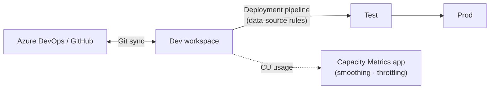

# Module 8 — ALM & Capacity

**Story chapter:** *"Ship changes safely — and watch the meter"*

~10 min · Mostly **show-and-tell** (Git, deployment pipelines, capacity metrics).

> **UI-only module** — no `run.ps1`. Git integration, deployment pipelines, and the Capacity Metrics app are portal features. Follow the steps below.

---

## Where this fits

| Before | This module | After |
| --- | --- | --- |
| Everything built in Dev workspace | **Promote** to Test with rules | Module 9 adds AI on governed gold |

Contoso's platform team needs **Dev/Test/Prod** discipline and visibility into **capacity units (CUs)** — especially after a demo week of Spark notebooks, pipeline runs, and report refreshes.



---

## 8.1 Git integration

1. **Workspace settings → Git integration** → connect Azure DevOps or GitHub.
2. Change something small (rename a measure) → **uncommitted change** badge.
3. **Source control** → diff → **Commit**.

Use feature workspaces per branch. Limits: 1,000 items per workspace, 25 MB/file. The ALM story mirrors application code.

---

## 8.2 Deployment Pipeline

1. **Deployment pipelines → Create** → **`dp_retail`** (Dev / Test / Prod).
2. Assign **`Fabric-Demo-Workshop`** → Dev, **`Fabric-Demo-Workshop-Test`** → Test.
3. **Deploy** Dev → Test.
4. **Deployment rule:** data-source rule swaps test/prod connections — Test never hits prod data.

Unassigning a stage permanently erases its deployment history — use caution during production cutovers.

---

## 8.3 Capacity Metrics app

1. Install **Microsoft Fabric Capacity Metrics** (AppSource, first time).
2. Point at your capacity (e.g. `ntwfabricdemo` F4).
3. Show **CU ribbon**, smoothing/bursting, carryforward debt.

| Concept | One line |
| --- | --- |
| **CU** | Throughput per second on F-SKU (F4 = 4 CUs/sec) |
| **Smoothing** | Interactive ~5 min; background 24h — absorbs spikes |
| **Throttling** | Sustained debt → delay → reject (Metrics app) |

Pause dev capacity nights/weekends. F64 is the threshold where free Power BI viewers become possible. OneLake storage bills separately from compute.

---

## 8.4 Wrap-up

> *"One copy of data, every engine, one governance and lifecycle model. Everything sat on the same Delta files in OneLake."*

```powershell
pwsh module-0-setup/setup.ps1 -Action pause   # stop billing
```

---

## Checklist → Module 9 (optional)

- [ ] Git commit from workspace
- [ ] Dev → Test deploy with a rule
- [ ] Capacity Metrics app opened

**Next:** [`module-9-ai-agents-copilot/`](../module-9-ai-agents-copilot/README.md) — *"Ask Contoso's gold layer a question in English."*
